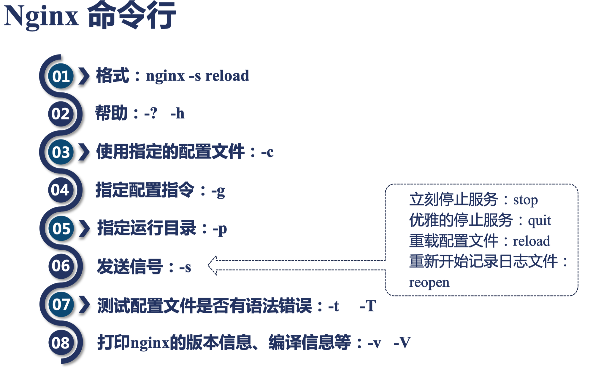

## 10 | Nginx命令行及演示：重载、热部署、日志切割




**重载配置文件**

`./nginx -s reload`

**热部署**

```bash
ps -ef | grep nginx
cp nginx{,.old}

## Master
kill -USR2 pid

## Old Master
kill -WINCH pid
```

**切割日志**

```bash
cp access.log{,.bak}
./nginx -s reopen
```